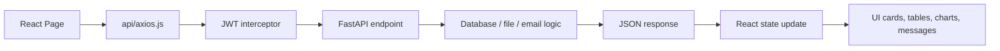
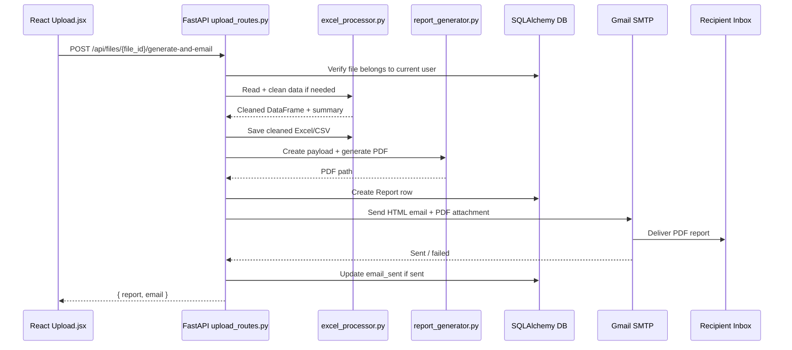
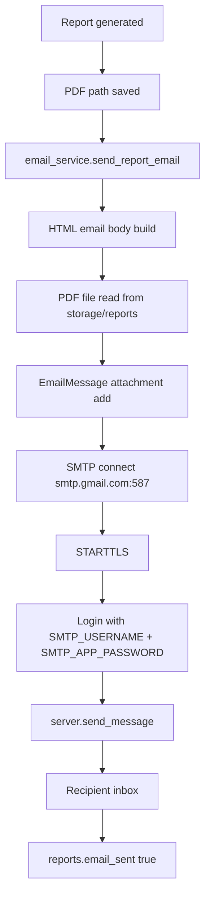
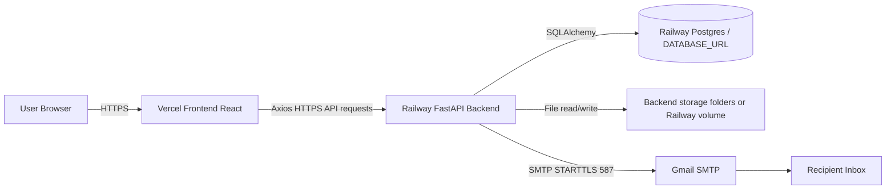

# NoctraGrid Relay — Complete Professional Documentation

> Project branding: **NoctraGrid Relay**  
> Premium tagline: **Obsidian-grade spreadsheet intelligence that cleans, reports, and delivers itself.**  
> Main requirement covered: user email ID enter karta hai, backend generated PDF ko automatically Gmail App Password SMTP ke through recipient inbox me send karta hai.

---

## 1. Project ka high-level idea

NoctraGrid Relay ek full-stack automation SaaS-style project hai. User Excel ya CSV upload karta hai. Backend file ko safely save karta hai, Pandas se clean karta hai, ReportLab se PDF report generate karta hai, database me report history save karta hai, aur user ke diye hue email address par generated PDF ko Gmail SMTP App Password ke through send karta hai.

Project ka core promise:

```text
Messy spreadsheet → Clean dataset → Smart PDF report → Gmail SMTP email delivery → Saved history
```

Is project me frontend React + Vite par bana hai, backend FastAPI par bana hai, database SQLAlchemy ORM ke through connect hota hai, files backend storage folders me save hoti hain, authentication JWT token se hota hai, aur admin/user role separation backend level par enforce hota hai.

---

## 2. Complete project workflow

### 2.1 User-facing workflow

1. User signup/login karta hai.
2. Frontend JWT token ko localStorage me save karta hai.
3. User Upload page par Excel/CSV choose karta hai.
4. Frontend file ko `multipart/form-data` request ke through backend par bhejta hai.
5. Backend file extension validate karta hai.
6. Backend uploaded file ko `backend/app/storage/uploads/` me save karta hai.
7. Backend file ko Pandas se read karta hai aur preview return karta hai.
8. User recipient email enter karta hai.
9. User **Generate PDF + Auto Email** button click karta hai.
10. Frontend backend endpoint `/api/files/{file_id}/generate-and-email` call karta hai.
11. Backend agar file clean nahi hui hai to automatically clean karta hai.
12. Backend cleaned Excel/CSV output save karta hai.
13. Backend smart report payload banata hai.
14. Backend ReportLab se PDF generate karta hai.
15. Backend `reports` table me report record create karta hai.
16. Backend Gmail SMTP App Password ke through email compose karta hai.
17. Backend generated PDF ko attachment ke roop me recipient email par send karta hai.
18. Agar email sent ho jata hai, backend `report.email_sent = true` save karta hai.
19. Frontend success message show karta hai.
20. User history/detail page se PDF, cleaned Excel, aur CSV download kar sakta hai.

### 2.2 Mermaid workflow diagram

```mermaid
flowchart TD
    A[User Login / Signup] --> B[JWT token localStorage me save]
    B --> C[Upload Excel/CSV]
    C --> D[POST /api/files/upload]
    D --> E[Backend saves original file]
    E --> F[Preview returned to React]
    F --> G[User enters recipient email]
    G --> H[POST /api/files/{file_id}/generate-and-email]
    H --> I[Pandas data cleaning]
    I --> J[Cleaned Excel + CSV saved]
    J --> K[Report payload created]
    K --> L[ReportLab PDF generated]
    L --> M[Report saved in database]
    M --> N[Gmail SMTP email with PDF attachment]
    N --> O[Email sent status saved]
    O --> P[React shows success + report actions]
```

---

## 3. Technology stack

| Layer | Technology | Purpose |
|---|---|---|
| Frontend | React 18 | UI components, pages, state, routing |
| Frontend build | Vite | Fast local dev server and production build |
| Routing | React Router | Landing, Login, Signup, Dashboard, Upload, History, Report Detail, Settings, Admin Analytics |
| HTTP client | Axios | Backend API requests with JWT Authorization header |
| Charts | Recharts | Dashboard/report/admin charts |
| Backend | FastAPI | REST APIs, auth, file upload, report generation, email automation |
| Data processing | Pandas + OpenPyXL | Excel/CSV read, cleaning, export |
| PDF generation | ReportLab | Professional PDF report creation |
| Database ORM | SQLAlchemy | Models, database connection, queries |
| Auth | JWT + bcrypt | Login/signup/admin auth and password hashing |
| Email | Python `smtplib` + Gmail SMTP App Password | Send generated PDF attachment by email |
| Deployment | Vercel + Railway | Frontend hosting + backend/API hosting |

---

## 4. Folder structure and purpose

```text
noctra-grid-relay/
├── backend/
│   ├── app/
│   │   ├── main.py
│   │   ├── database.py
│   │   ├── models.py
│   │   ├── schemas.py
│   │   ├── auth.py
│   │   ├── bootstrap.py
│   │   ├── routes/
│   │   │   ├── auth_routes.py
│   │   │   ├── upload_routes.py
│   │   │   ├── report_routes.py
│   │   │   ├── history_routes.py
│   │   │   ├── analytics_routes.py
│   │   │   └── admin_routes.py
│   │   ├── utils/
│   │   │   ├── excel_processor.py
│   │   │   ├── report_generator.py
│   │   │   ├── email_service.py
│   │   │   ├── analytics.py
│   │   │   └── serializers.py
│   │   └── storage/
│   │       ├── uploads/
│   │       ├── cleaned/
│   │       └── reports/
│   ├── requirements.txt
│   ├── Procfile
│   ├── railway.json
│   └── .env.example
├── frontend/
│   ├── src/
│   │   ├── App.jsx
│   │   ├── main.jsx
│   │   ├── api/axios.js
│   │   ├── context/AuthContext.jsx
│   │   ├── components/
│   │   ├── pages/
│   │   ├── styles/
│   │   └── utils/
│   ├── package.json
│   ├── vercel.json
│   └── .env.example
├── sample_data/
├── docs/
└── README.md
```

---

## 5. React ka role aur purpose

React frontend user interface handle karta hai. Iska main kaam hai:

- Landing page show karna.
- User signup/login/admin login forms manage karna.
- JWT token ko browser localStorage me store karna.
- Protected routes render karna.
- Spreadsheet upload form handle karna.
- API calls send karna.
- Preview data tables show karna.
- Charts render karna.
- Report history/detail pages show karna.
- Gmail SMTP email automation ke backend result ko user-friendly status me show karna.
- Admin analytics dashboard show karna.

React sirf UI aur API communication layer hai. File cleaning, database writes, PDF generation, SMTP email sending jaise heavy/secure tasks backend karta hai.

---

## 6. React file-by-file explanation

### 6.1 `frontend/src/main.jsx`

Entry point hai. Ye React app ko DOM ke `#root` element me mount karta hai.

Flow:

```text
main.jsx → BrowserRouter → AuthProvider → App
```

Yahan global CSS files import hoti hain:

- `global.css`
- `landing.css`
- `dashboard.css`

### 6.2 `frontend/src/App.jsx`

Routing map define karta hai.

Important routes:

| Route | Component | Purpose |
|---|---|---|
| `/` | `Landing` | Public landing page |
| `/login` | `Login` | User/admin login |
| `/signup` | `Signup` | User signup / admin login mode |
| `/dashboard` | `Dashboard` | Protected user dashboard |
| `/upload` | `Upload` | Main upload + auto email workflow |
| `/history` | `History` | User report history |
| `/reports/:reportId` | `ReportDetail` | Report detail + charts + downloads |
| `/settings` | `Settings` | Profile and env visibility |
| `/analytics` | `Analytics` | Admin-only analytics/control panel |

`DashboardLayout` left sidebar + main content shell provide karta hai.

### 6.3 `frontend/src/context/AuthContext.jsx`

Auth state ka central store hai.

Responsibilities:

- App start hone par localStorage se token check karna.
- `/api/auth/me` call karke logged-in user fetch karna.
- Login/signup/adminLogin helper functions provide karna.
- JWT token ko `noctragrid_token` key ke under localStorage me store/remove karna.
- `logout()` function provide karna.

Data flow:

```text
Login/Signup page → AuthContext login/signup → backend API → JWT token → localStorage → user state → protected pages
```

### 6.4 `frontend/src/api/axios.js`

Axios instance create karta hai.

Important logic:

```js
baseURL: import.meta.env.VITE_API_BASE_URL || "http://localhost:8000"
```

Har request se pehle interceptor localStorage se JWT token uthata hai aur header me add karta hai:

```http
Authorization: Bearer <JWT_TOKEN>
```

Ye file frontend-backend communication ka gateway hai.

### 6.5 `frontend/src/pages/Landing.jsx`

Public branded landing page hai. Ye premium hacker vibe, product features, workflow, and contact form show karta hai.

Backend calls:

- `POST /api/analytics/visit` — anonymous visit tracking
- `POST /api/analytics/lead` — contact lead store + owner alert email if configured

### 6.6 `frontend/src/pages/Login.jsx`

User login aur admin login tabs handle karta hai.

Backend calls:

- User login: `POST /api/auth/login`
- Admin login: `POST /api/auth/admin/login`

Successful login ke baad:

- Admin user → `/analytics`
- Normal user → `/dashboard`

### 6.7 `frontend/src/pages/Signup.jsx`

Normal user account create karta hai. Admin mode me admin login form dikhata hai.

Backend calls:

- Signup: `POST /api/auth/signup`
- Admin login: `POST /api/auth/admin/login`

### 6.8 `frontend/src/pages/Dashboard.jsx`

Logged-in user ka overview dashboard hai.

Backend call:

- `GET /api/reports`

Data use:

- Total reports
- Rows processed
- Duplicates removed
- SMTP emails sent
- Recent reports chart

Chart hover issue yahin fix hua hai by using dark Recharts tooltip config from `utils/chartTheme.js`.

### 6.9 `frontend/src/pages/Upload.jsx`

Project ka most important page. Yahi main automation flow hai.

Important states:

- `file` — selected spreadsheet
- `uploadResult` — backend upload response
- `cleanResult` — optional manual clean response
- `report` — generated report response
- `email` — recipient email
- `emailSent` — email sent status
- `loading` — current action state

Important backend calls:

| Button/action | API call |
|---|---|
| Upload File | `POST /api/files/upload` |
| Clean Data Only | `POST /api/files/{file_id}/clean` |
| Generate Report Only | `POST /api/files/{file_id}/generate-report` |
| Generate PDF + Auto Email | `POST /api/files/{file_id}/generate-and-email` |
| Send Again | `POST /api/reports/{report_id}/email` |

Main required flow:

```text
User selects file → Upload File → User enters email → Generate PDF + Auto Email → backend sends PDF by Gmail SMTP
```

### 6.10 `frontend/src/pages/History.jsx`

User ke saved reports show karta hai.

Backend calls:

- `GET /api/history`
- `DELETE /api/history/{report_id}`

Download buttons helper `downloadReportFile()` use karte hain.

### 6.11 `frontend/src/pages/ReportDetail.jsx`

Single report ka full detail page hai:

- Summary cards
- Download PDF/Excel/CSV
- Send PDF again by email
- Category bar chart
- Pie chart
- Date trend line chart
- Insights
- Cleaned data preview

Backend calls:

- `GET /api/reports/{report_id}`
- `POST /api/reports/{report_id}/email`
- Download endpoints through helper

### 6.12 `frontend/src/pages/Analytics.jsx`

Admin-only page hai. Normal user is page ko access nahi kar sakta.

Backend calls:

- `GET /api/analytics/summary`
- `GET /api/analytics/leads`
- `GET /api/analytics/visits`
- `GET /api/admin/activity`
- `GET /api/admin/users`
- `GET /api/admin/reports`
- `DELETE /api/admin/users/{id}`
- `DELETE /api/admin/reports/{id}`

### 6.13 `frontend/src/components/Sidebar.jsx`

Logged-in dashboard ka left premium navigation rail hai.

Links:

- Command Deck
- SMTP Relay
- Report Vault
- Identity Core
- Owner Console admin-only

### 6.14 `frontend/src/components/Navbar.jsx`

Landing page top/right navigation bar hai. Premium glass tray design CSS se diya gaya hai.

### 6.15 `frontend/src/utils/chartTheme.js`

Chart hover issue yahin solve hua hai. Recharts tooltip default black/white clash ko replace karke dark glass tooltip config diya gaya hai:

- `tooltipProps`
- `axisProps`
- `gridProps`
- `legendProps`

---

## 7. Frontend data flow



Example Upload page flow:

```text
Upload.jsx
  → api.post('/api/files/upload')
  → backend upload route
  → preview returned
  → setUploadResult(data)
  → user enters email
  → api.post('/api/files/{file_id}/generate-and-email')
  → backend clean + PDF + SMTP
  → setReport(data.report), setEmailSent(data.email.sent)
```

---

## 8. Backend complete workflow

FastAPI backend project ka secure automation brain hai. Ye file processing, database operations, PDF generation, email sending, auth, admin authorization, and analytics handle karta hai.

Backend start hone par:

1. `main.py` FastAPI app create karta hai.
2. `database.py` database engine/session configure karta hai.
3. `models.py` ke SQLAlchemy tables create hote hain.
4. Storage folders ensure hote hain:
   - `uploads/`
   - `cleaned/`
   - `reports/`
5. CORS configure hota hai using `FRONTEND_URL`.
6. Routers include hote hain.
7. Startup event me `bootstrap.py` admin account ensure karta hai.

---

## 9. Backend file-by-file explanation

### 9.1 `backend/app/main.py`

FastAPI application ka entry point.

Responsibilities:

- App title/description/version define karna.
- Database tables create karna.
- Storage directories create karna.
- CORS allow origins set karna.
- Routers include karna.
- Startup event par admin bootstrap run karna.
- `/` and `/health` endpoints provide karna.

Connections:

```text
main.py → database.py → models.py
main.py → routes/*.py
main.py → bootstrap.py
main.py → excel_processor storage dirs
```

### 9.2 `backend/app/database.py`

Database connection configure karta hai.

Important behavior:

- Local `.env` load karta hai.
- `DATABASE_URL` read karta hai.
- Default local database: `sqlite:///./noctragrid.db`
- Agar Railway/Postgres URL `postgres://` format me aaye, to `postgresql://` me convert karta hai.
- SQLAlchemy `engine`, `SessionLocal`, and `Base` create karta hai.
- `get_db()` dependency request ke liye DB session provide karta hai.

### 9.3 `backend/app/models.py`

Database tables define karta hai.

Tables:

| Model | Table | Purpose |
|---|---|---|
| `User` | `users` | User/admin accounts |
| `UploadedFile` | `uploaded_files` | Original upload metadata + cleaned paths |
| `Report` | `reports` | PDF/cleaned output paths + summary + email status |
| `Visit` | `visits` | Landing page anonymous visits |
| `Lead` | `leads` | Contact form submissions |
| `ActivityLog` | `activity_logs` | Platform events |

Relationships:

```text
User 1 → many UploadedFile
User 1 → many Report
UploadedFile 1 → many Report
```

### 9.4 `backend/app/schemas.py`

Pydantic request/response models define karta hai.

Important schemas:

- `UserCreate`
- `UserLogin`
- `AuthResponse`
- `UploadResponse`
- `CleanResponse`
- `GenerateReportResponse`
- `EmailReportRequest`
- `EmailResponse`
- `GenerateAndEmailResponse`
- `VisitCreate`
- `LeadCreate`

`GenerateAndEmailResponse` one-click endpoint ke liye added hai:

```python
class GenerateAndEmailResponse(BaseModel):
    report: GenerateReportResponse
    email: EmailResponse
```

### 9.5 `backend/app/auth.py`

Authentication helper file.

Responsibilities:

- Password hashing with bcrypt.
- Password verify karna.
- JWT access token create karna.
- Current user resolve karna via `Authorization: Bearer <token>`.
- Admin guard `require_admin()` provide karna.

Security flow:

```text
Login success → JWT generated → Frontend stores token → Every protected API call includes Bearer token → get_current_user validates token → route executes
```

### 9.6 `backend/app/bootstrap.py`

Admin owner account ensure karta hai.

Env variables:

- `ADMIN_NAME`
- `ADMIN_EMAIL`
- `ADMIN_PASSWORD`
- `ADMIN_SYNC_PASSWORD`
- `ALLOW_MULTIPLE_ADMINS`

Behavior:

- Backend startup par configured admin account create/sync hota hai.
- Default local credentials demo ke liye available hain.
- Production me credentials 반드시 change karni chahiye.
- `ALLOW_MULTIPLE_ADMINS=false` hone par only configured admin admin role rakhta hai.

### 9.7 `backend/app/routes/auth_routes.py`

Auth APIs handle karta hai.

Endpoints:

| Endpoint | Method | Purpose |
|---|---|---|
| `/api/auth/signup` | POST | Normal user signup |
| `/api/auth/login` | POST | Normal user login |
| `/api/auth/admin/login` | POST | Admin owner login |
| `/api/auth/me` | GET | Current logged-in user |

### 9.8 `backend/app/routes/upload_routes.py`

Main file automation router hai.

Endpoints:

| Endpoint | Purpose |
|---|---|
| `POST /api/files/upload` | Original Excel/CSV upload + preview |
| `POST /api/files/{file_id}/clean` | Manual clean step |
| `POST /api/files/{file_id}/generate-report` | Manual report generation |
| `POST /api/files/{file_id}/generate-and-email` | One-click clean + PDF + save + SMTP email |

Important internal helper:

```python
create_report_for_uploaded_file(uploaded, current_user, db)
```

Ye function:

1. Existing cleaned file check karta hai.
2. Agar clean nahi hua to Pandas cleaning karta hai.
3. Cleaned Excel/CSV save karta hai.
4. Report payload banata hai.
5. PDF generate karta hai.
6. DB me `Report` record create karta hai.
7. `report_generated` activity log karta hai.

`generate_and_email_report()` ye helper use karta hai, phir `send_report_email()` call karta hai.

### 9.9 `backend/app/routes/report_routes.py`

Reports listing/detail/download/email APIs.

Endpoints:

| Endpoint | Purpose |
|---|---|
| `GET /api/reports` | Current user reports |
| `GET /api/reports/{report_id}` | Report detail |
| `GET /api/reports/{report_id}/download/pdf` | PDF download |
| `GET /api/reports/{report_id}/download/excel` | Cleaned Excel download |
| `GET /api/reports/{report_id}/download/csv` | Cleaned CSV download |
| `POST /api/reports/{report_id}/email` | Existing PDF email send/re-send |

Security: `get_owned_report()` ensures current user only apna report access kare.

### 9.10 `backend/app/routes/history_routes.py`

Current user report history show/delete karta hai.

Endpoints:

- `GET /api/history`
- `DELETE /api/history/{report_id}`

Delete karte time backend PDF/cleaned file paths bhi remove karta hai.

### 9.11 `backend/app/routes/analytics_routes.py`

Public tracking + admin analytics handle karta hai.

Public endpoints:

- `POST /api/analytics/visit`
- `POST /api/analytics/lead`

Admin-only endpoints:

- `GET /api/analytics/summary`
- `GET /api/analytics/leads`
- `GET /api/analytics/visits`
- `GET /api/analytics/admin-activity`

Lead/visitor owner alerts bhi Gmail SMTP service use karte hain if configured.

### 9.12 `backend/app/routes/admin_routes.py`

Admin control APIs.

Endpoints:

- `GET /api/admin/users`
- `GET /api/admin/reports`
- `GET /api/admin/activity`
- `DELETE /api/admin/users/{user_id}`
- `DELETE /api/admin/reports/{report_id}`

Security: `require_admin` dependency. Normal users ko 403 Forbidden milega.

### 9.13 `backend/app/utils/excel_processor.py`

Spreadsheet handling and cleaning logic.

Functions:

| Function | Purpose |
|---|---|
| `sanitize_filename()` | Filename safe banana |
| `validate_extension()` | Only `.xlsx` and `.csv` allow karna |
| `save_upload_file()` | Original upload save karna |
| `read_dataframe()` | CSV/Excel ko Pandas DataFrame me read karna |
| `standardize_column_name()` | Column names lowercase/snake_case me convert karna |
| `make_unique_columns()` | Duplicate column names unique banana |
| `detect_and_convert_numeric()` | Numeric-looking columns detect karna |
| `detect_and_convert_dates()` | Date-looking columns detect karna |
| `clean_dataframe()` | Main cleaning pipeline |
| `save_cleaned_files()` | Cleaned Excel + CSV save karna |
| `dataframe_preview()` | UI ke liye first rows JSON-safe preview |

Cleaning pipeline:

```text
Read DataFrame
→ standardize columns
→ trim spaces
→ empty strings as null
→ remove fully empty columns
→ detect numeric/date columns
→ remove duplicate rows
→ fill numeric nulls with 0
→ fill text nulls with Unknown
→ create cleaning summary
```

### 9.14 `backend/app/utils/report_generator.py`

PDF/report payload generator.

Responsibilities:

- Numeric summaries generate karna.
- Top categories calculate karna.
- Chart data prepare karna.
- Rule-based insights generate karna.
- Report payload create karna.
- Unique PDF path create karna.
- ReportLab PDF generate karna.

Generated PDFs yahan save hote hain:

```text
backend/app/storage/reports/
```

### 9.15 `backend/app/utils/email_service.py`

Gmail SMTP email automation ka central module.

Important functions:

| Function | Purpose |
|---|---|
| `smtp_config()` | Env variables se SMTP config create karna |
| `is_smtp_configured()` | Required SMTP variables present hain ya nahi |
| `owner_email_configured()` | Owner alert email ready hai ya nahi |
| `sender_address()` | Friendly From header banana |
| `send_smtp_email()` | Generic HTML email + attachment SMTP se send karna |
| `send_report_email()` | Generated PDF report recipient ko send karna |
| `send_owner_visitor_alert()` | Owner ko new visitor alert send karna |
| `send_owner_lead_alert()` | Owner ko contact lead alert send karna |

Important: Ye file Python standard library `smtplib` use karti hai. Render mail worker ya third-party email API ki dependency nahi hai.

### 9.16 `backend/app/utils/analytics.py`

Activity log helper aur browser label helper.

- `log_activity()` database me event save karta hai.
- `browser_label()` user-agent se readable browser name return karta hai.

### 9.17 `backend/app/utils/serializers.py`

SQLAlchemy model objects ko frontend-friendly dictionaries me convert karta hai.

Functions:

- `safe_json_loads()`
- `report_to_dict()`
- `admin_report_to_dict()`
- `admin_user_to_dict()`
- `lead_to_dict()`
- `visit_to_dict()`
- `activity_to_dict()`

---

## 10. Automation flow in detail

### 10.1 One-click automation endpoint

Endpoint:

```http
POST /api/files/{file_id}/generate-and-email
Authorization: Bearer <JWT_TOKEN>
Content-Type: application/json

{
  "recipient_email": "recipient@gmail.com"
}
```

Backend flow:



### 10.2 Why backend does automation, not frontend

Frontend ko SMTP password kabhi nahi milna chahiye. Agar SMTP app password browser me expose ho gaya to koi bhi misuse kar sakta hai. Isliye:

- User sirf recipient email enter karta hai.
- SMTP credentials backend `.env` / Railway variables me secure rahte hain.
- Backend email send karta hai.
- Frontend sirf success/failure message show karta hai.

---

## 11. API requests kaise send aur receive hoti hain

### 11.1 Axios request example

```js
const { data } = await api.post(
  `/api/files/${uploadResult.file_id}/generate-and-email`,
  { recipient_email: email }
);
```

`api/axios.js` automatically JWT header add karta hai:

```http
Authorization: Bearer <token>
```

### 11.2 Backend request receive flow

1. FastAPI route match hota hai.
2. Pydantic request body validate karta hai.
3. `get_current_user` JWT validate karta hai.
4. Database session `get_db` se milta hai.
5. Route logic execute hoti hai.
6. Response Pydantic schema ke through JSON me convert hota hai.
7. Frontend `data` receive karta hai.

---

## 12. Networking kaise kaam karti hai

### 12.1 Local development

```text
Browser React app: http://localhost:5173
Backend FastAPI:   http://localhost:8000
```

Frontend `.env`:

```env
VITE_API_BASE_URL=http://localhost:8000
```

Backend `.env`:

```env
FRONTEND_URL=http://localhost:5173
```

Request travel:

```text
React browser → http://localhost:8000/api/... → FastAPI → DB/files/SMTP → JSON response → React
```

CORS isliye zaroori hai kyunki frontend aur backend different ports par run hote hain. `main.py` me CORS middleware configured hai.

### 12.2 Production: Vercel + Railway

```text
User Browser
  ↓ HTTPS
Vercel Frontend: https://your-frontend.vercel.app
  ↓ HTTPS API calls using VITE_API_BASE_URL
Railway Backend: https://your-backend.up.railway.app
  ↓ DB connection
Railway Postgres or configured DATABASE_URL
  ↓ SMTP
smtp.gmail.com:587
  ↓
Recipient inbox
```

Production variables:

Frontend Vercel:

```env
VITE_API_BASE_URL=https://your-backend.up.railway.app
```

Backend Railway:

```env
FRONTEND_URL=https://your-frontend.vercel.app
```

CORS rule backend ko batata hai ki Vercel domain se browser requests allow karni hain. Iske bina browser request block kar sakta hai.

---

## 13. Database: kahan hai, kaise connect hota hai, kis purpose ke liye use hota hai

### 13.1 Local database

Default:

```env
DATABASE_URL=sqlite:///./noctragrid.db
```

Ye backend working directory ke relative SQLite file create karta hai.

### 13.2 Production database

Railway deployment ke liye recommended:

```env
DATABASE_URL=postgresql://...
```

Railway Postgres attach karne par Railway aapko DB URL deta hai. Backend `database.py` us URL ko read karta hai aur SQLAlchemy engine create karta hai.

### 13.3 Database me kya store hota hai

| Data | Table | Stored content |
|---|---|---|
| User accounts | `users` | name, email, hashed password, admin flag |
| Uploaded files | `uploaded_files` | original filename, file path, cleaned paths, row/column count, status |
| Reports | `reports` | PDF path, cleaned output paths, summary JSON, email status |
| Visits | `visits` | page, browser/user-agent, anonymous session id |
| Leads | `leads` | contact form name, email, role, message |
| Activity | `activity_logs` | event type, description, actor email, timestamp |

Passwords raw form me store nahi hote. Sirf bcrypt hashed passwords store hote hain.

---

## 14. User data kahan aur kaise store hota hai

### 14.1 Browser side

Browser localStorage:

| Key | Purpose |
|---|---|
| `noctragrid_token` | JWT access token |
| `noctragrid_anonymous_session_id` | Landing visit tracking anonymous session |

Browser me SMTP credentials store nahi hote.

### 14.2 Backend database side

User info `users` table me store hoti hai:

- name
- email
- hashed_password
- is_admin
- created_at

### 14.3 Backend file system side

Uploaded/processed files backend storage me save hote hain:

```text
backend/app/storage/uploads/   original uploaded files
backend/app/storage/cleaned/   cleaned xlsx/csv files
backend/app/storage/reports/   generated pdf reports
```

---

## 15. Generated PDFs kahan create aur store hoti hain

PDF generation file:

```text
backend/app/utils/report_generator.py
```

Storage directory:

```text
backend/app/storage/reports/
```

PDF path `reports.pdf_file_path` database column me save hota hai.

Download endpoint:

```http
GET /api/reports/{report_id}/download/pdf
```

Email attachment same PDF path se read hota hai.

Important deployment note: Railway filesystem normally ephemeral ho sakta hai. Long-term production storage ke liye Railway volume, S3, Cloudinary, Supabase Storage, ya similar persistent object storage use karna better rahega. Portfolio/demo ke liye current local storage flow simple aur understandable hai.

---

## 16. Email automation complete workflow

### 16.1 SMTP variables

Backend `.env` / Railway variables:

```env
SMTP_HOST=smtp.gmail.com
SMTP_PORT=587
SMTP_USE_TLS=true
SMTP_USE_SSL=false
SMTP_USERNAME=your-gmail-address@gmail.com
SMTP_APP_PASSWORD=your_16_character_google_app_password
SMTP_FROM_NAME=NoctraGrid Relay
SMTP_FROM_EMAIL=your-gmail-address@gmail.com
SMTP_REPLY_TO_EMAIL=your-gmail-address@gmail.com
OWNER_ALERT_EMAIL=your-gmail-address@gmail.com
SMTP_STRIP_PASSWORD_SPACES=true
```

### 16.2 Gmail App Password ka use

Gmail normal account password SMTP me use nahi karna. Google App Password use karna hai. Agar app password spaces ke saath paste hota hai, backend default `SMTP_STRIP_PASSWORD_SPACES=true` se spaces remove kar deta hai.

### 16.3 Report email flow



### 16.4 Owner alerts

Same SMTP service contact form aur visitor alert ke liye bhi use hoti hai:

- `send_owner_visitor_alert()`
- `send_owner_lead_alert()`

Agar `OWNER_ALERT_EMAIL` set nahi hai to owner alerts silently configured false return karte hain. Project crash nahi hota.

---

## 17. Authentication aur authorization

### 17.1 Signup

```text
React Signup.jsx → POST /api/auth/signup → password hash → users row → JWT returned
```

### 17.2 Login

```text
React Login.jsx → POST /api/auth/login → password verify → JWT returned
```

### 17.3 Admin login

```text
React Login.jsx admin mode → POST /api/auth/admin/login → ensure_admin_user → verify admin env email/password → JWT returned
```

### 17.4 JWT validation

Protected backend routes use:

```python
current_user: User = Depends(get_current_user)
```

Admin-only backend routes use:

```python
admin: User = Depends(require_admin)
```

### 17.5 User access isolation

Normal user reports only by user id filter:

```python
Report.id == report_id and Report.user_id == current_user.id
```

Iska matlab user dusre user ka report/download/email access nahi kar sakta.

---

## 18. Environment variables complete explanation

### 18.1 Backend env variables

| Variable | Purpose |
|---|---|
| `SECRET_KEY` | JWT signing secret. Production me long random string use karo. |
| `ACCESS_TOKEN_EXPIRE_MINUTES` | JWT expiry duration. Default 7 days. |
| `DATABASE_URL` | SQLite/Postgres database connection URL. |
| `FRONTEND_URL` | CORS allowed frontend URL. Vercel URL yahan set hota hai. |
| `APP_BRAND_NAME` | Email templates me brand name. |
| `ADMIN_NAME` | Owner/admin display name. |
| `ADMIN_EMAIL` | Admin login email. |
| `ADMIN_PASSWORD` | Admin login password. |
| `ADMIN_SYNC_PASSWORD` | true hone par env password DB admin password sync karta hai. |
| `ALLOW_MULTIPLE_ADMINS` | false hone par only configured admin account admin rahta hai. |
| `SMTP_HOST` | Gmail ke liye `smtp.gmail.com`. |
| `SMTP_PORT` | Gmail STARTTLS ke liye `587`. |
| `SMTP_USE_TLS` | Port 587 ke liye `true`. |
| `SMTP_USE_SSL` | Port 465 SSL use karna ho to true. Current default false. |
| `SMTP_USERNAME` | Gmail address used for SMTP login. |
| `SMTP_APP_PASSWORD` | Google App Password. Secret. GitHub me commit nahi karna. |
| `SMTP_FROM_NAME` | Inbox me sender display name. |
| `SMTP_FROM_EMAIL` | Sender email. Usually same as Gmail username. |
| `SMTP_REPLY_TO_EMAIL` | Reply-To address. |
| `OWNER_ALERT_EMAIL` | Contact form/visitor alert receiver email. |
| `SMTP_STRIP_PASSWORD_SPACES` | App password me spaces remove karna. Default true. |

### 18.2 Frontend env variables

| Variable | Purpose |
|---|---|
| `VITE_API_BASE_URL` | Backend base URL. Local: `http://localhost:8000`; production: Railway backend URL. |

---

## 19. Deployment architecture: Vercel frontend + Railway backend

### 19.1 Production architecture diagram



### 19.2 Deployment steps summary

1. GitHub repository push karo.
2. Railway par backend deploy karo from `backend/`.
3. Railway env variables set karo.
4. Railway backend public URL copy karo.
5. Vercel par frontend deploy karo from `frontend/`.
6. Vercel env set karo:

```env
VITE_API_BASE_URL=https://your-railway-backend-url
```

7. Railway env me frontend URL set karo:

```env
FRONTEND_URL=https://your-vercel-frontend-url
```

8. Redeploy both services.
9. Browser se Vercel frontend open karo.
10. API calls Vercel se Railway backend par jayengi.

### 19.3 Request path after deployment

Example: user clicks Generate PDF + Auto Email.

```text
Browser on Vercel UI
→ POST https://your-railway-backend.up.railway.app/api/files/12/generate-and-email
→ Railway FastAPI validates JWT
→ Railway backend reads file + database
→ PDF generated on backend storage
→ SMTP call to smtp.gmail.com:587
→ Gmail sends PDF to recipient
→ Railway returns JSON to Vercel frontend
→ UI shows success
```

### 19.4 CORS explanation

Browser security blocks frontend domain se backend domain request unless backend allow kare. Backend `main.py` me CORS middleware:

- `FRONTEND_URL` env se allowed origin leta hai.
- Localhost origins allow karta hai.
- Vercel preview URLs ke liye regex allow hai.

Production me `FRONTEND_URL` sahi set karna important hai.

---

## 20. Local setup guide

### 20.1 Backend setup

```bash
cd backend
python -m venv venv
source venv/bin/activate   # Windows: venv\Scripts\activate
pip install -r requirements.txt
cp .env.example .env
```

`.env` edit karo, especially SMTP variables.

Run backend:

```bash
uvicorn app.main:app --reload
```

Backend URL:

```text
http://localhost:8000
```

Health check:

```text
http://localhost:8000/health
```

### 20.2 Frontend setup

```bash
cd frontend
npm install
cp .env.example .env
npm run dev
```

Frontend URL:

```text
http://localhost:5173
```

### 20.3 Default admin credentials

Local demo default:

```text
Admin ID: admin@noctragriddemo.com
Password: NoctraGridAdmin@123
```

Production me `.env` / Railway variables se change karna.

---

## 21. API documentation summary

### Auth

```http
POST /api/auth/signup
POST /api/auth/login
POST /api/auth/admin/login
GET  /api/auth/me
```

### Files

```http
POST /api/files/upload
POST /api/files/{file_id}/clean
POST /api/files/{file_id}/generate-report
POST /api/files/{file_id}/generate-and-email
```

### Reports

```http
GET  /api/reports
GET  /api/reports/{report_id}
GET  /api/reports/{report_id}/download/pdf
GET  /api/reports/{report_id}/download/excel
GET  /api/reports/{report_id}/download/csv
POST /api/reports/{report_id}/email
```

### History

```http
GET    /api/history
DELETE /api/history/{report_id}
```

### Analytics/Admin

```http
POST   /api/analytics/visit
POST   /api/analytics/lead
GET    /api/analytics/summary          # admin only
GET    /api/analytics/leads            # admin only
GET    /api/analytics/visits           # admin only
GET    /api/admin/users                # admin only
GET    /api/admin/reports              # admin only
GET    /api/admin/activity             # admin only
DELETE /api/admin/users/{id}           # admin only
DELETE /api/admin/reports/{id}         # admin only
```

---

## 22. Maintenance and scaling notes

### 22.1 Email scaling

Current SMTP solution is perfect for small/demo use because user already has Google App Password. Gmail has sending limits; large-scale SaaS production ke liye dedicated transactional provider ya workspace-level quotas consider karna hoga. Project architecture me `email_service.py` isolated hai, so future me SMTP provider swap easy hai.

### 22.2 File storage scaling

Current filesystem storage simple hai. Production scale ke liye:

- AWS S3
- Cloudflare R2
- Supabase Storage
- Railway volume

Use kar sakte ho. Replace points:

- `excel_processor.save_upload_file()`
- `excel_processor.save_cleaned_files()`
- `report_generator.generate_pdf_report()`
- download endpoints in `report_routes.py`

### 22.3 Database scaling

Local SQLite demo ke liye okay hai. Production me Railway Postgres recommended hai.

### 22.4 Frontend scaling

Pages/components already separated hain. Future improvements:

- Add global toast system.
- Add background job queue for huge files.
- Add per-user email audit table.
- Add object storage signed URLs.
- Add PDF template customization.

---

## 23. What changed in this version

1. Project rebranded from old identity to **NoctraGrid Relay**.
2. Tagline updated to premium futuristic branding.
3. Resend/Render-style email approach removed.
4. Gmail App Password SMTP implemented with Python `smtplib`.
5. New one-click endpoint added: `/api/files/{file_id}/generate-and-email`.
6. Upload UI redesigned so user enters email and PDF auto-sends.
7. Chart tooltip hover color issue fixed with dark Recharts theme.
8. Sidebar redesigned into premium hacker-style relay navigation.
9. Landing top/right nav redesigned with glass tray premium look.
10. Documentation rewritten as a complete project understanding guide.

---

## 24. Quick mental model

Agar future me project modify karna ho, ye yaad rakho:

```text
React = UI + API calls
Axios = backend request gateway
FastAPI routes = request handlers
SQLAlchemy models = database structure
Excel processor = spreadsheet cleaning
Report generator = PDF/report payload
Email service = Gmail SMTP delivery
Storage folders = uploaded/cleaned/generated files
Auth module = JWT + password security
Admin routes = protected owner controls
```

Most important flow:

```text
Upload.jsx → /api/files/upload → upload_routes.py → excel_processor.py
Upload.jsx → /api/files/{id}/generate-and-email → upload_routes.py
upload_routes.py → excel_processor.py → report_generator.py → models.py/database.py → email_service.py → Gmail SMTP
```

That is the full NoctraGrid Relay architecture.
